# 🗃️ DataForge — Dynamic Workspace & No-Code Data Modeling Platform

<div align="center">

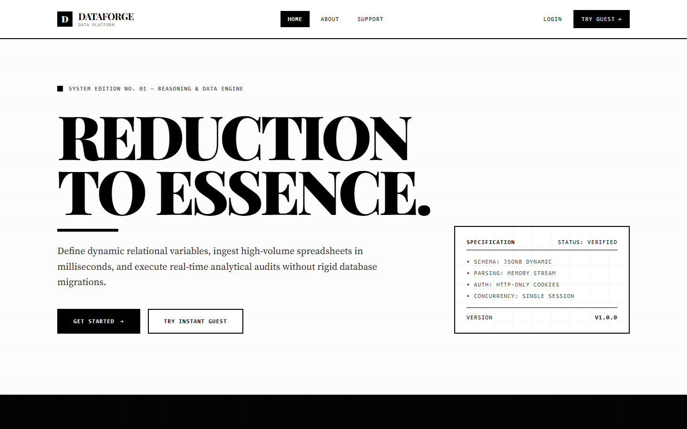

[](https://react.dev/)
[](https://tailwindcss.com/)
[](https://nodejs.org/)
[](https://expressjs.com/)
[](https://neon.tech/)
[](https://www.chartjs.org/)
[](#license)

</div>

---

## 🌟 Executive Summary

**DataForge** is a full-stack, enterprise-grade **Dynamic Workspace & Schema Modeling SaaS Platform**. Built with React 19, Tailwind CSS v4, Node.js, Express, and Neon PostgreSQL, DataForge enables organizations to construct custom dataset schemas on-the-fly without database migrations, ingest thousands of records via high-speed Excel stream parsing, enforce single-session security constraints, and analyze categorical and numerical data in real-time through vibrant analytical charts.

Designed with an architectural **Minimalist Monochrome** design system, DataForge delivers high contrast, sharp 0px architectural borders, editorial typography (`Playfair Display`, `Source Serif 4`, `JetBrains Mono`), and instant zero-latency UI state transitions.

---

## ⚡ Key Architectural Highlights

* **Dynamically Configurable Schemas (`JSONB`)**: Define custom fields (text, numerical, decimals, dates, select dropdowns) per workspace. Data is stored in a PostgreSQL `JSONB` column, enabling schema flexibility without running SQL migrations.
* **Vibrant Analytics Engine**: Automatically computes min, max, mean, and distribution metrics, rendering real-time Chart.js doughnut and line visualizers with custom high-contrast color palettes.
* **Enterprise Security & Session Control**:
  * **Single Active Session Limit**: Prevents multi-device account sharing by tracking active token UUIDs (`JTI`) in `active_sessions`.
  * **In-Memory Token Context**: JWTs are transferred via HTTP-Only, SameSite cookies and verified in React memory (`AuthContext`), mitigating XSS token theft.
  * **Custom CSRF Middleware**: Validates custom request headers on mutating endpoints.
* **Role-Based Access & Global Audit Feed**:
  * **Admin**: Unrestricted access to all system workspaces, user management, and global audit logs.
  * **Manager (Team Leader)**: Scoped visibility into team activity feeds and member dataset modifications.
  * **User**: Workspace record management without permission to access system audit feeds.
* **High-Speed RAM Stream File Ingestion**: Processes multi-row Excel spreadsheets (`.xlsx`, `.csv`) directly from memory buffers using `SheetJS` and PostgreSQL `jsonb_array_elements` in unified database transactions.

---

## 📸 Platform Tour & Visual Gallery

### 1. Landing Page & Editorial Hero Layout
A stark visual showcase highlighting platform capabilities, luxury editorial typography, 4px section rules, and tiered plan offerings.


---

### 2. Authentication & Guest Access Shell
Secure login and registration interface supporting role selection, guest demo instant authentication, and 0px input fields.

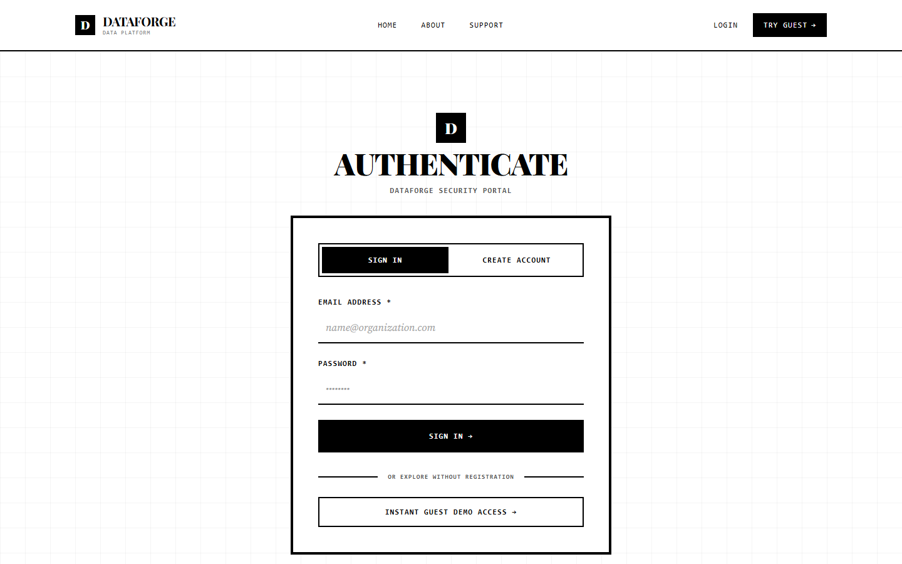

---

### 3. Workspaces Directory & On-the-Fly Schema Builder
Workspace management view featuring search filters, field type definitions, analytic flag controls, and schema creation modals.

| Workspaces Directory | Schema Builder Modal |
| :---: | :---: |
| 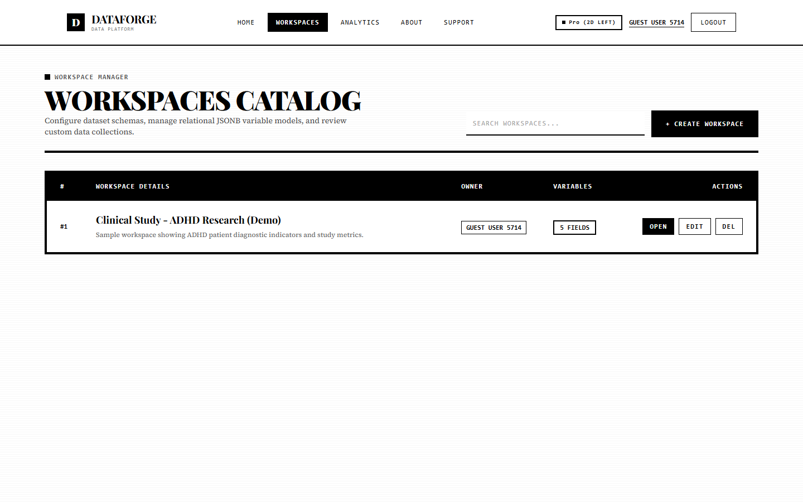 | 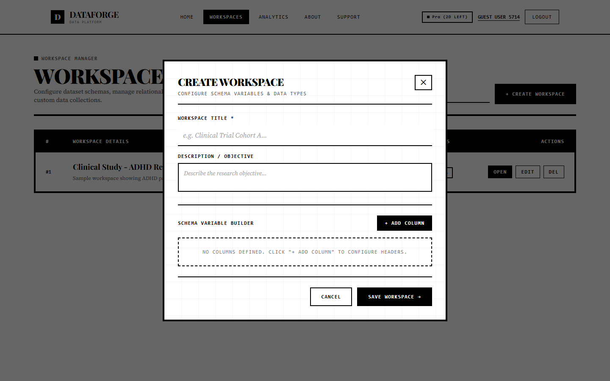 |

---

### 4. Interactive Data Grid & Record Entry
Architectural table layout supporting custom field display, record insertion, bulk Excel imports, and sequential row indexes (`#1, #2...`).

| Records Data Grid | Add Record Modal |
| :---: | :---: |
| 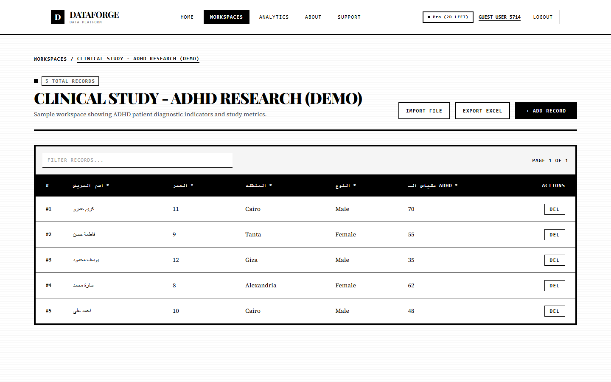 | 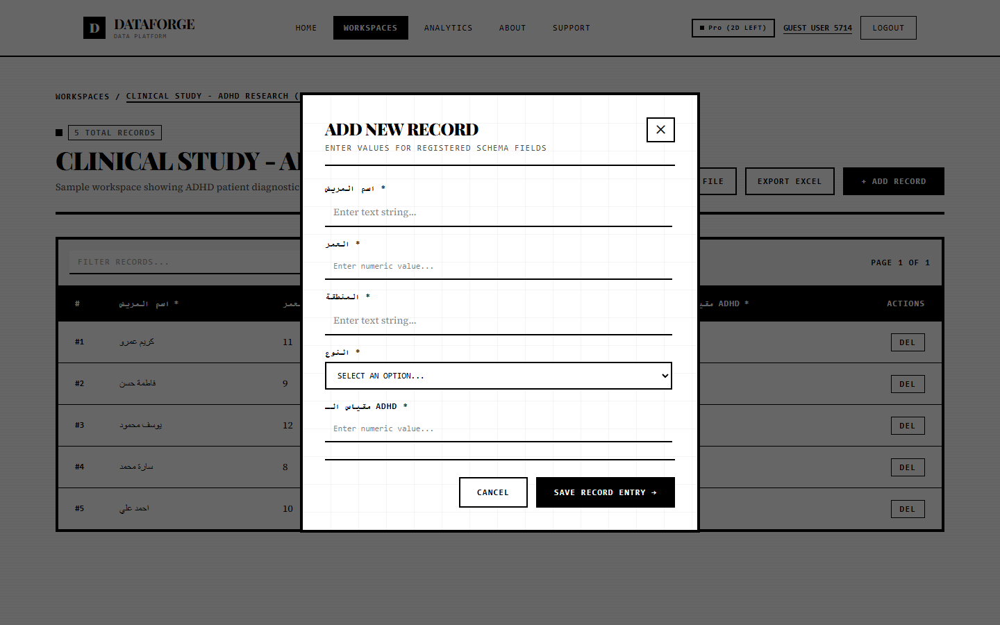 |

---

### 5. Real-Time Analytics Dashboard & Vibrant Charts
Computes workspace-level dataset metrics in real-time, rendering distinct color-coded Doughnut distribution charts and Line trend graphs.

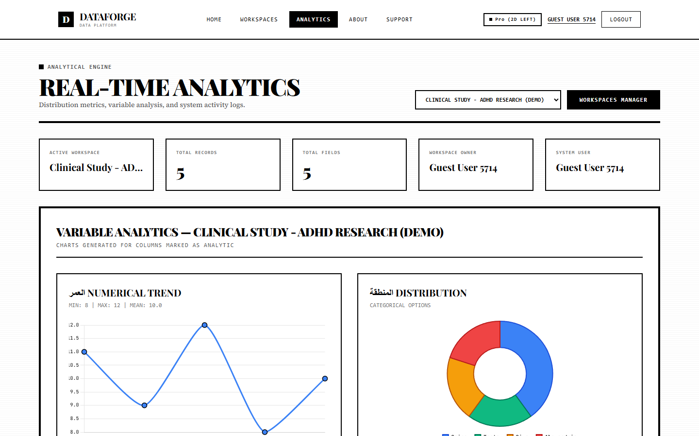

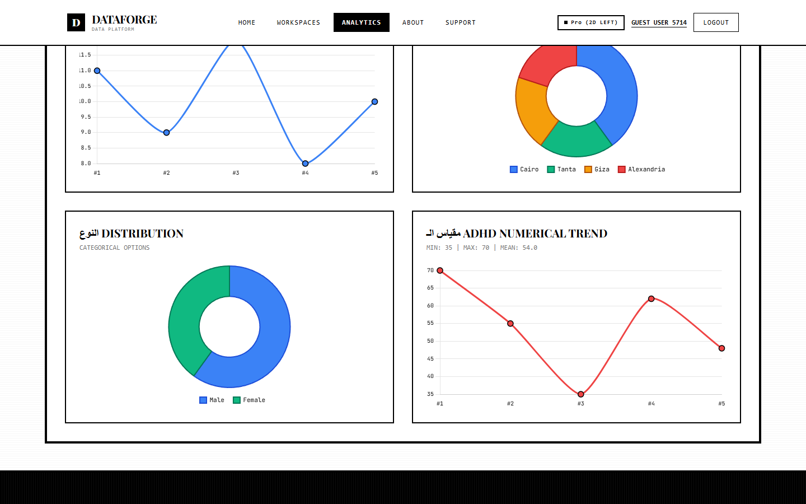

---

### 6. Role-Scoped Activity Audit Feed
Admin and Team Leader activity feed displaying user action timestamps, workspace mutation details, and user initials badges.

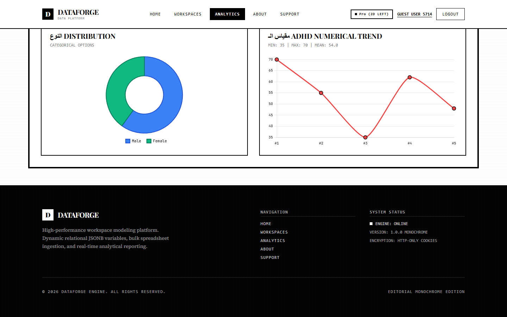

---

### 7. Editorial About & Support Center
Magazine-style layout featuring serif drop-caps, sharp milestone boxes, and interactive support request forms.

| Editorial About Page | Support & Contact Directory |
| :---: | :---: |
| 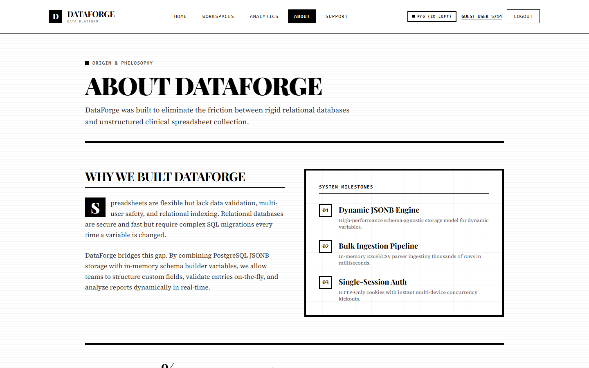 | 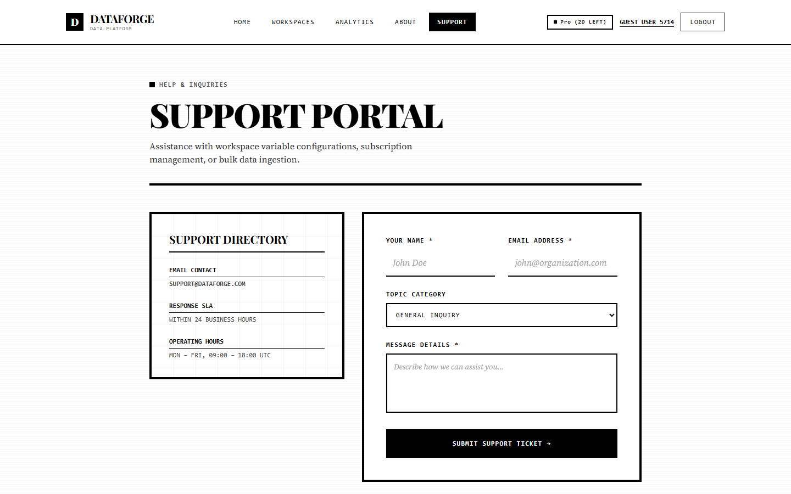 |

---

## 🛠️ Tech Stack & Architecture

### **Frontend Architecture**
* **Framework**: React 19 (Vite SPA)
* **Styling**: Tailwind CSS v4 (`@theme` customized tokens)
* **Typography**: Google Fonts (`Playfair Display`, `Source Serif 4`, `JetBrains Mono`)
* **State & Routing**: React Context API (`AuthContext`), React Router v7
* **Data Visualization**: Chart.js 4.5, `react-chartjs-2`

### **Backend Architecture**
* **Runtime**: Node.js v24 (ES Modules)
* **API Framework**: Express.js
* **Database**: PostgreSQL (Neon.tech Serverless Cloud)
* **Authentication**: JSON Web Tokens (JWT), Bcryptjs, HTTP-Only Cookie Session Store
* **File Upload**: Multer (Memory Storage Buffer), SheetJS (`xlsx`)

---

## 📊 Role & Permission Matrix

| Feature / Action | Admin | Manager (Team Leader) | Normal User | Guest User |
| :--- | :---: | :---: | :---: | :---: |
| **Create & Manage Workspaces** | ✅ Full Access | ✅ Owned Workspaces | ✅ Tier Limited | ⚡ Trial (2 Workspaces) |
| **Ingest Records & Excel Upload** | ✅ | ✅ | ✅ | ✅ |
| **View Variable Analytics** | ✅ | ✅ | ✅ | ✅ |
| **View Audit Logs Feed** | ✅ Global Feed | ✅ Team Workspaces Only | ❌ Hidden | ❌ Hidden |
| **User Directory Management** | ✅ | ❌ | ❌ | ❌ |

---

## 🚀 Local Development & Quick Start

### 1. Clone Repository
```bash
git clone https://github.com/Ashraf-khaled-w/DataForge.git
cd DataForge
```

### 2. Backend Setup
```bash
cd backend
pnpm install

# Initialize PostgreSQL schema tables and indexes
node src/config/initDb.js

# Start Express Server on http://localhost:3000
pnpm start
```

### 3. Frontend Setup
```bash
cd ../frontend/my-research-app
pnpm install

# Start Vite Development Server on http://localhost:5173
pnpm run dev
```

---

## 📄 License

Distributed under the MIT License. See `LICENSE` for more information.

<div align="center">
  <sub>Built with precision by <strong>Ashraf Khaled</strong></sub>
</div>
